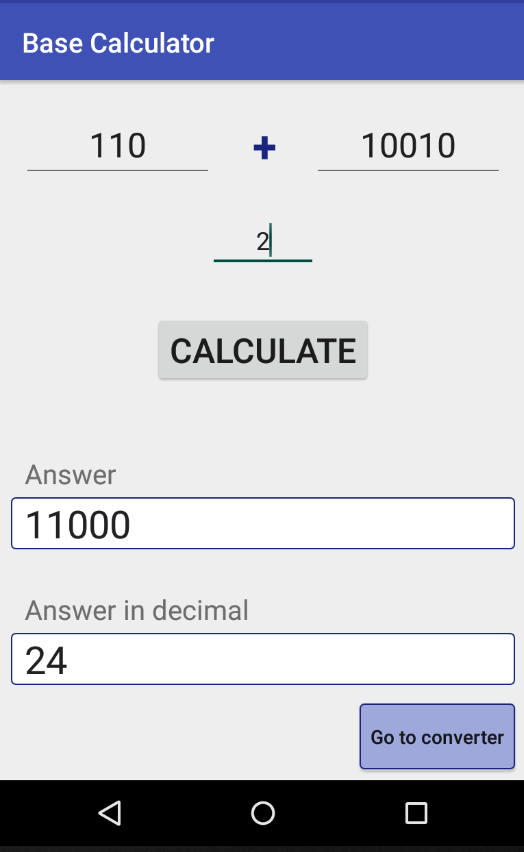
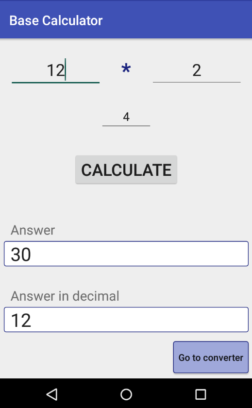

<h1>Base Calculator</h1>

This is the app that allows you to add, subtract, multiply and divide in radices from 2 to 36.

  

It works not only with binary but also with "exotic" radices:

  &nbsp;&nbsp;&nbsp;
  

There is also a converter that works from any radix to any (within range of 2 to 36):

  

